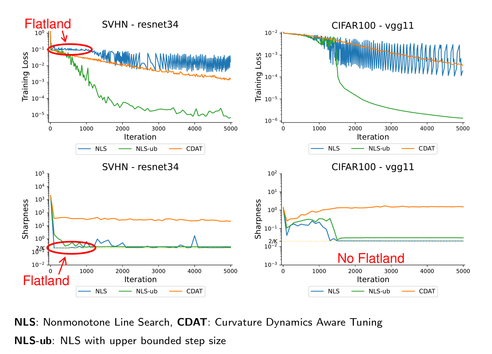

# Flatland: The Adventures of Gradient Descent with Large Step Sizes

This code runs the experiments given in the paper "Flatland: The Adventures of Gradient Descent with Large Step Sizes", which was accepted at ICML 2026. [[arXiv]](https://arxiv.org/pdf/2606.06722) [[Poster]](https://recorder-v3.slideslive.com/?share=111309&s=51496d74-1a85-43eb-8507-67827ec46966)

When training neural networks with very large step sizes, gradient descent globally minimizes the sharpness, but Flatland is saddle point, and it should be avoided to turn unsuccesful trainings (NLS) into very successful ones (NLS-ub).




## Installation

Clone the project:
```
git clone https://github.com/curtfox/flatland.git
```

To avoid issues, we suggest using Python 3.11 (or later) when running our project, although other versions may work.

Install necessary packages (first install the local project package, then install other necessary external packages):
```
pip install .
pip install -r requirements.txt
```

## Running Experiments

To run the experimental script, run the following command:

```
python python_scripts/run_experiments.py --dataset DATASET --model MODEL --batch_size BATCH_SIZE --epochs EPOCHS --mode MODE
```

Note that for full batch mode, set batch_size = "full".

Each MODE corresponds to a different set of experiments in our paper. Modify the DATASET and MODEL parameters above in order to run with the chosen dataset and model.

MODE 0: Runs the experiments given in Figure 1 and Appendix I.1 comparing the different optimizers. To run the experiments using the cross entropy loss as given in Appendix H (rather than the MSE loss), modify line 46 of the run.experiments.py script from "mse" to "ce".

MODE 1: Runs the experiments given in Figure 2 and Appendix I.2 detailing a smaller set of iterations of our NLS method.

MODE 2: Runs the experiments comparing NLS and CDAT to NLS-ub given in Figure 3 and Appendix I.3.

MODE 3: Runs the experiments testing the segment smoothness condition given in Figure 4 and Appendix I.4.

MODE 4: Runs the stochastic experiments given in Appendix E. Ensure BATCH_SIZE is set to 256 to replicate our experiments in the paper. 

MODE 5: Runs the delta ablation experiments given in Appendix G.

MODE 6: Runs the warmup experiments given in Appendix D.

MODE 7: Runs the no bias experiments given in Appendix J.

To run the vision transformer experiments in Appendix F, use MODE 0 and model "tinyVIT".

## Plotting Results

To plot the experiments, use the following command:

```
python python_scripts/plot_experiments.py --exp EXP
```

Note that EXP is just the MODE of the experiment that you want to plot.
